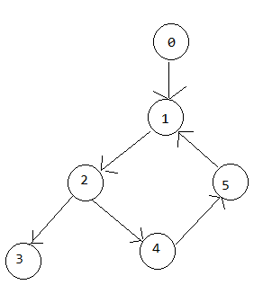

# 다중 트리 구현

```
public class Department {
    private String name;
    private int count;
    // private Department parent;
    private List<Department> children = new ArrayList<>();

    Department(){}

    public Department(String name, int count){
        this.name = name;
        this.count = count;
    }

    public void addChild(Department dept) {
        if (dept == this) {
            throw new IllegalArgumentException("Cannot add a node as its own child.");
        }

        //dept.setParent(this);
        this.children.add(dept);
    }

    public boolean addChild(String name, int count) {
        if (isUnderThousand(count)) {
            this.addChild(new Department(name, count));
            return true;
        }
        return false;
    }

    public List<Department> getChildren(){
        return children;
    }

    //private void setParent(Department department) {
    //    this.parent = department;
    //}

    public String getName(){
        return name;
    }

    public boolean setCount(int count){
        if (isUnderThousand(count)) {
            this.count = count;
            return true;
        }
        return false;
    }

    public int getCount() {
        return count;
    }

    //public Department getParent(){
    //    return parent;
    //}

    private boolean isUnderThousand(int count) {
        return count <= 1000;
    }
}
```
트리구조는 계층적인 관계를 가지는 비순환적인 그래프이다. 트리는 하나의 루트 노드에서 시작하여 여러 개의 자식 노드를 가지고, 각 자식 노드는 다시 자신의 자식 노드를 가질 수 있다. 이런 구조로 인해 트리는 계층 구조를 표현하는데 유용하다.

트리구조를 구현할 때 주의해야할 점 한 가지는 circular reference가 없게 해야한다는 것이다.

[이미지 출처](https://stackoverflow.com/questions/37907339/how-to-detect-circular-reference-in-a-tree)

위의 이미지에서 4번 노드가 5번 노드를 가리키고 있는 것이 circular reference이다. 한 노드에서 시작하여 다시 자신을 참조하거나, 두 개 이상의 노드가 서로를 참조하여 무한히 순환하는 상태를 의미한다. 즉, 어떤 노드를 따라가면서 다시 처음 노드로 돌아오는 경로가 형성되는 것을 말한다. 트리 구조에 이 circular reference가 있는 경우, 이는 더이상 트리가 아닌 그래프이며 트리를 탐색하거나 처리할 때 무한 루프에 빠지거나 원하지 않은 동작을 수행할 수 있다.

만약 노드가 부모를 참조한다면 순환 참조 문제가 발생할 수 있다. 

예를 들어 위의 Department클래스를 가지고 있는 조직 트리를 만든다고 할 때, 발생할 수 있는 부모-자식간의 순환참조 문제는 다음과 같다.

```
Department dev = new Department("DEV", 100);
Department hr = new Department("HR", 200);
Department FM = new Deparmtment("FM", 50);

dev.addChild(hr); //DEV의 자식노드로 HR을 참조
hr.addChild(dev); //HR은 자식노드로 DEV를 참조 -> 순환참조 발생
```

그래서 n-ary 트리에서는 부모를 참조하지 않고 각 노드가 자식 노드만을 참조하는 방식을 선호한다. 이렇게 하면 트리의 구조가 단순해지고, 순환참조가 발생할 확률이 줄어든다. 또 부모-자식 관계를 쉽게 탐색하고 트리의 다양한 기능을 구현할 수 있다.각 노드가 자식 노드만을 참조한다고 해서 순환참조가 발생하지 않는 것은 아니다. 그렇기 때문에 개발자가 노드에 자식을 추가하기 전에, 이미 조상중에 해당 노드가 있는가를 적절한 방식으로 확인해야한다.

n-ary 트리에서 자식 노드를 검색하는 방법중에는 깊이우선탐색(DFS)과 너비우선탐색(BFS)이 있다. 

[트리구조 잘 정리된 글](https://medium.com/quantum-ant/%ED%8A%B8%EB%A6%AC-tree-cec69cfddb14)