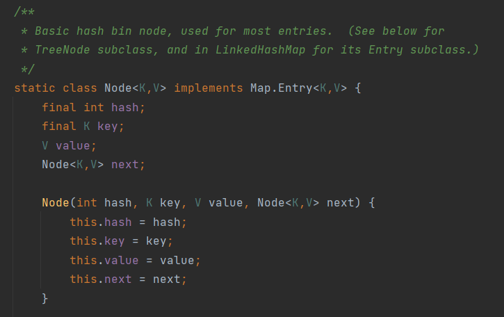
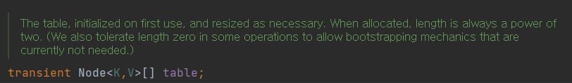
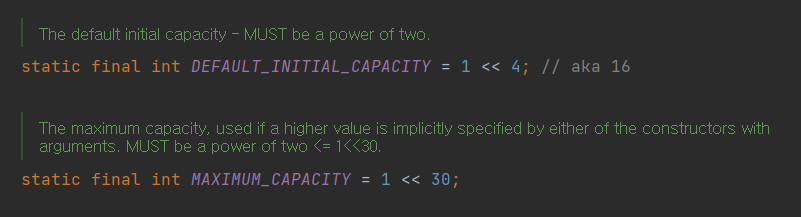

# Map

## Map이란?
- key와 value로 이루어진 한 쌍의 데이터를 저장하는 데이터 저장 구조(architecture)
- HashTable, HashMap, TreeMap 등의 구현 클래스를 가진다

## HashMap

### HashMap이란?
- Map 인터페이스를 구현한 클래스
- 해싱을 통해 데이터를 저장하고 검색한다
- Java의 HashTable을 기능과 성능을 개선한 클래스. HashTable대신 사용하자.

## HashMap의 특징
1. Hash Table의 구조를 그대로 사용
    - 데이터를 저장하는 LinkedList와 LinkedList의 첫 Node를 저장하는 array로 구성
    
    
2. 내부적으로 LinkedList를 사용
    - 한정되지 않은 수의 데이터를 저장하는데 사용됨 (<-> 배열)
    - 비연속적인 저장공간을 가진다
3.  Hash Table 답게 검색 속도가 빠르다 [hash table 글](https://github.com/HyeKyungAhn/TIL/blob/main/Programming/Hash_Table.md) 참고
4. Key, Value로 이루어진 한 쌍의 데이터를 저장
5. key는 각각 유일한 값이어야한다. 데이터를 저장하고 검색하기 위한 기준이 되는 값이기 때문
6. 중복된 key로 값을 저장하면 값이 새로 저장되는 데이터로 덮어 씌워짐
7. 디폴트 HashMap의 array 길이는 24, 최대 길이는 230
    
8. 저장 순서 유지를 보장하지 않는다
9. 새로 저장하려는 요소(key)가 새로운 요소임을 판단하는 기준
    1. hashCode()의 반환값이 일치하지 않거나(or)
    2. equals()가 false일 때
    - 따라서 HashMap에 저장할 새로운 클래스를 정의할 때 주소값이 아닌 다른 기준으로 요소를 비교하고 싶다면, equlas() 뿐만 아니라 hashCode()도 오버라이딩을 해야한다.

### 해싱(Hashing)
- 해싱이란 해쉬함수로 유일한 값을 얻어 데이터를 저장하고 검색하는 기법을 말함
- 검색속도를 최적화하기 위해서는
    1. 저장될 데이터의 수에 따라 적절하게 array의 index를 설정해야한다
    2. 중복값 반환을 최소화하는 **Hash Argorithm**을 사용하는 것이 중요하다

#### HashMap에서의 해싱
1. key를 Hash 함수의 인자로 넘겨 유일한 값(음이 아닌 정수, HashCode)을 얻는다
2. HashCode를 배열의 index로 변환(보통 나누기 연산)하여 배열의 index에 저장된 LinkedList에 접근한다
3. LinkedList에 동일한 key가 있는지 확인한 후 있다면 덮어쓰기를, 없다면 새로 저장(add)한다

## TreeMap

### TreeMap의 특징
- 이진 검색 트리의 형태로 키와 값의 쌍을 저장하는 데이터 구조
- 검색과 '정렬'에 적합하다
    - 하지만 HashMap이 검색 성능이 더 뛰어나다

## 참고
자바의 정석