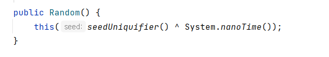

# Math.random()과 java.util.Random의 차이

Math.randon()을 쓰는 나에게
지피티는 이런 답변을 줬다.

    무작위 확률 생성: 현재 코드에서는 Math.random() 메서드를 사용하여 확률을 생성하고 있습니다. 그러나 이는 테스트에 어려움을 주거나 확률 생성의 일관성을 보장하기 어렵게 만들 수 있습니다. 대신 java.util.Random 클래스를 사용하여 무작위 수를 생성하는 것이 좋습니다.

Math.random()은 정말 확률 생성의 일관성을 보장하기 힘들까? java.util.Random 클래스가 '더' 무작위인 수를 생성하는 걸까?

Java JDK17의 API doc으로 가서 Math.random() 메서드에대해 살펴보자

## Math.random()

    Returns a double value with a positive sign, greater than or equal to 0.0 and less than 1.0. Returned values are chosen pseudorandomly with (approximately) uniform distribution from that range.
    When this method is first called, it creates a single new pseudorandom-number generator, exactly as if by the expression

        new java.util.Random()
        
    This new pseudorandom-number generator is used thereafter for all calls to this method and is used nowhere else.

- Math.random()을 호출하면 0.0 과 같거나 크고, 1.0보다 작은 값을 돌려받는다
- 이 메서드가 호출되면 새로운 새로운 '가사랜덤 숫자 생성기' 하나를 만드는데, 이는 정확히 다음 표현과 같다. **new java.util.Random()**
- 이 생성기는 그 이후 random()메서드의 모든 호출에 사용되고 다른 곳에서는 사용되지 않음

Math.random()은 내부적으로 java.util.Random 클래스의 인스턴스를 사용하고 있었다. Math.random()의 실제 구현은 아래와 같다.

        public final class Math{
            ...
            public static double random() {
                return RandomNumberGeneratorHolder.randomNumberGenerator.nextDouble();
            }
            ...
            private static final class RandomNumberGeneratorHolder {
                static final Random randomNumberGenerator = new Random();
            }    
            ..
        }
        

Math.random()은 내부적으로 java.util.Random 클래스의 nextDouble()를 사용하고 있다. 그럼 chatGPT의 답변이 영틀린 걸까?

## java.util.Random
### Random은 seed를 설정할 수 있다
#### 잠깐! 난수에 대해 잠시 정리하고 가자
난수는 무엇인가? 난수는 그 다음에 나올 값을 확신할 수 없을 때 난수라고 한다. 컴퓨터는 '진짜' 난수를 생성할 수 없다. 사람처럼 임의로 선택할 수 없는 기계이기 때문에 계산된 결과인 난수를 생성하기 위해서는 **입력값**이 있어야한다. 그래서 컴퓨터에서 만드는 난수는 **의사난수**(pseudorandom number)이다. 결과론적인 방법으로 생성되어 진정한 의미의 난수는 아니지만, 그 결과를 쉽게 예측할 수 없기 떄문에 어느정도 난수로서 인정하고 있는 것이다. (반대로 진정한 의미의 난수를 만들고 싶다면 입력값을 임의로 입력할 수 있는 사용자나, 외부환경에서 받으면 된다.)

컴퓨터에서 의사난수를 생성하기 위해 사용하는 입력값을 seed라고 한다. (seed나 난수가 더 궁금하다면 [여기로!](https://ko.wikipedia.org/wiki/%EB%82%9C%EC%88%98) ) seed 값을 사용하는 Random 클래스의 설명을 잠시 읽어보자.

    If two instances of Random are created with the same seed, and the same sequence of method calls is made for each, they will generate and return identical sequences of numbers. ...

만약 두개의 Random 인스턴스가 같은 seed로 생성되었고, 동일한 순서로 각 인스턴스의 메서드를 호출 하면 동일한 숫자들을 생성 및 반환한다. Random 클래스는 이러한 특성을 보장하도록 특정한 알고리즘을 사용하여 구현했다. 

### 시간
Random 클래스는 기본적으로 seed값을 시간으로 준다. (보다시피, 시간'만' 주는건 아니다)

지나간 시간은 다시 돌아오지 않고 나노 단위로 시간을 센다면, 계산된 결과값인 난수를 쉽게 추측할 수 없게되니 시간은 seed값으로 적절하다고 볼 수 있다. 

### 임의의 seed
이미 소제목에서 스포를 했듯이, Randon클래스는 이 seed값을 long타입으로 설정할 수 있다. 앞서 완전한 난수를 만드는 방법이 사용자, 외부환경으로부터 입력받은 seed값을 사용하는 것이었음을 다시 떠올려보면 Random 클래스는 Math.random() 메서드보다 더욱 예측할 수 없는 진정한 의미의 난수를 제공할 수 있다. (하지만.. 나는 콘솔로 입력값을 받는 작은 java app을 만들고 있었을 뿐인데.. 지피티가 너무 과한 조언을 했다.)

## 어떻게 매번 임의의 seed 값을 받어?
임의의 seed값을 받는 것은 쉽지 않은 일이다. 사용자로부터 입력받는 모든 값이 unique한 값일리는 만무하고, 노이즈 추출, 진공에서의 양자요동(...)([나무위키](https://namu.wiki/w/%EB%82%9C%EC%88%98%EC%83%9D%EC%84%B1))등 자연의 무작위성을 활용하여 입력값을 받을수는 있으나 개인이 하기에는 참 어려운 방법이다. 

java 에서는 Random 외에도 강력히 암호화된 난수를 제공하는 SecureRandom 클래스를 제공한다. SecureRandom 클래스는 다음에 또 공부해보기로 하자.
