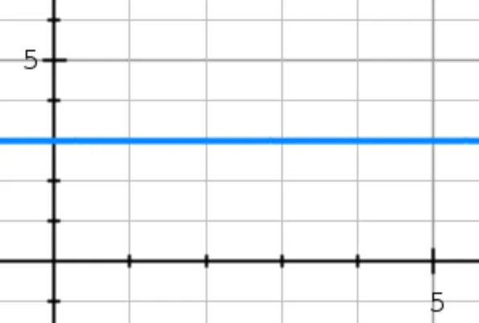

# BigO 표기법

## Asymptotic notation(점근 표기법)
- 알고리즘의 성능을 표현하는 수학적 표기법
- 알고리즘의 시간과 공간 복잡도에 관한 대략적이나 의미있는 추정을 할 수 있도록 도와준다
- 종류
    1. Big-O Notation(O)(Upper bound)
        - 최대한의 복잡도(최악의 경우에도 이 성능 이상을 보장)
    2. Big-Omega Notation(Ω)(Lower bound)
        - 최소한의 복잡도(최선의 경우에도 이 성능 이하를 보장)
    3. Big-Theta Notation(Tight bound)
        - 최대-최소 복잡도의 범위 내에 있음

## Big O 표기법이란?
- 알고리즘의 성능을 표현하는 수학적 표기법
- 데이터나 사용자의 증가에 따른 알고리즘의 성능 예측이 목적
    - 수량이 아닌 행위를 표시
    - 상수는 모두 1로 표시

## Constant Time

x = data, y = time
```
function(int[] n){
    return (n[0] == 0) ? true : false;
}
```
- 기능을 수행할 때 입력 데이터의 크기와 상관없이 항상 동일한 수의 단계를 밟거나 같은 시간이 걸리는 함수를 표현
- BigO 표기법으로는 O(1)이라고 한다
- BigO 표기법은 수치화가 아닌 알고리즘의 구조를 가늠하기위해 사용한다
    - 예를들어 어떤 함수가 input에 관련없이 항상 2단계의 과정을 통해 결과를 도출한다고 하자. 이를 BigO 표기법으로 O(2)가 아닌 O(1)로 표현한다. BigO는 함수의 수(quantity)가 아닌 함수의 행위를 표기하기 때문이다.

## Linear Time

x = data, y = time
```
function(int[] n){
    for(int i=0; i<n.length; i++){
        System.out.println(n[i]);
    }
}
```
- 입력 데이터가 클수록 더 많은 시간이 걸리는 함수를 말할 때 사용
- O(n)
    - n은 함수가 결과를 반환하기 위해 밟아야하는 단계의 수나 받아야하는 인풋을 의미하지만 직접적으로 숫자를 넣지않고 단순히 n으로만 표시한다
- 예시
```
let maxLimit = 100;

function oddSum(max) {
    let sum = 0;
        for(let i=1; i<=max; i++){
            if(i%2 != 0){
                sum += i;
            }
        }
    return sum;
}

console.log(oddSum(maxLimit));
```

## Quadratic Time(O(n<sup>2</sup>))

x = data, y = time
```
function(int[] n){
    for(int i=0; i<n.length; i++){
        for(int j=0; j<n.length; j++){
            System.out.println(i + j);
        }
    }
}
```
- 주어진 input 대비 함수의 수행 시간이 제곱으로 증가하는 함수
- input이 커질 수록 수직에 가까운 그래프가 됨
- 시각적으로 표현하자면, 입력값 갯수를 한 면으로 한 면적만큼 시간이 걸린다

- O(n<sup>2</sup>)

## Quadratic Time(O(nm))
```
function(int[] n, int[] m){
    for(int i=0; i<n.length; i++){
        for(int j=0; j<m.length; j++){
            System.out.println(i + j);
        }
    }
}
```
- n을 m만큼 반복

- input이 커질 수록 수직에 가까운 그래프가 됨

## Polynomial/cubic Time(O(n<sup>3</sup>))

```
function(int[] n){
    for(int i=0; i<n.length; i++){
        for(int j=0; j<n.length; j++){
            for(int k=0; k<n.length; k++){
                System.out.println(i + j + k);
            }
        }
    }
}
```

- input이 커질 수록 O(n<sup>2</sup>)보다 더 급격하게 시간이 증가

## Exponential Time(O(2<sup>n</sup>))
- 피보나치 수열

## O(log n)
- 이진 검색
- 한번 검색 처리가 진행될 때마다 찾아야하는 범위가 반으로 줄어드는 알고리즘의 시간 복잡도

## 시간 복잡도와 공간 복잡도

### 시간 복잡도
- 실행 중 얼마나 많은 시간이 걸리는가
- 구현과 프로그램 언어와 독립적임
- 프로그램의 복잡도라고 하면 보통 시간 복잡도를 이야기함
- 공간복잡도가 낮다고 해서 시간 복잡도가 낮지 않음(예를 들어 loop은 사용하는 메모리는 작아도 수백 번 반복되어 시간 복잡도가 높을 수 있다)

### 공간 복잡도
- 알고리즘이 성공적으로 실행될 때, 얼마나 많은 메모리(primary memory) 공간이 필요할 것인지를 예측하기 위해 사용하는 식
- 실행 도중 사용되는 변수나 지시 문들이 공간복잡도를 결정


## 출처
- https://levelup.gitconnected.com/time-complexity-and-bigo-notation-linear-time-constant-time-and-quadratic-time-686c279ecd88
- https://www.youtube.com/watch?v=6Iq5iMCVsXA
- https://www.youtube.com/watch?v=Si9MzFqBs8E