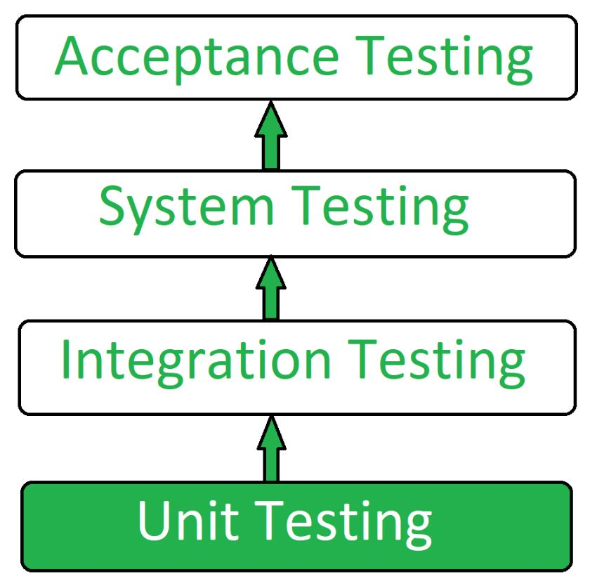

# 테스트

software test는 4 단계로 나눌 수 있습니다.

    

## 단위 테스트(Unit Test)
### 단위 테스트의 목적
- 새 코드를 작성하거나 리팩토링 시 테스트 대상이 **의도대로 동작하는지** , 요구사항을 충족하는지 확인하기 위함
- 애플리케이션의 통합테스트가 실행되기 전 개발 프로세스 초기단계에서 단위테스트를 수행한다
- 사용자와 애플리케이션은 다양한 수준에서 상호작용을 하기 때문에 앱을 개발할 때는 다양한 사용사례와 상호작용을 테스트해야한다
- (코드 변경 시) 각 단위에서 예상대로 동작하므로 발생한 버그가 프로그램 전체로 전파되는지 확인하는 것이 목표이다

### 단위 테스트의 단위
- 단위테스트를 할 떄에는 **작은 단위**(보통 인터페이스, 클래스나 **메서드**)별로 테스트한다

### 단위 테스트의 장점
- 단위 테스트를 작성하는 과정에서 코드의 모듈화를 자연스럽게 고민하게 된다
- 특정 단위(메서드)에 대한 테스트 케이스가 많아질 수록 해당 로직에 대한 신뢰도가 높아지고 그 단위의 관심사를 쉽게 파악할 수 있다.
- 빠르고 명확하다
- 코드 수정 후 빠르게 버그를 잡아낼 수 있어 코드 품질이 향상된다

### 단위 테스트의 작성
- 해당 단위의 기능과 조건에 맞는 결과를 철저하게 검사해야한다
- 단위 별로 하나 이상의 테스트가 존재할 수 있다
- 다른 코드로부터 **격리**하여 예상대로 동작하는지 확인
    - 해당 단위 이외의 모든 코드가 올바르게 작동한다고 가정하고 테스트를 작성함
- 하나의 테스트에서는 **하나의 기능만** 검증한다

## 통합 테스트
### 통합 테스트의 목적
모듈간의 상호작용시 의도대로 동작하는지 확인하는 테스트이다

### 통합 테스트의 장점
- 단위 테스트에서 예상하지 못한 버그를 찾을 수 있다

### 통합 테스트의 현실
- 신뢰성이 떨어질 수 있다
    - 단위테스트보다 더 많은 코드를 작성해야하고 그 과정에서도 실수를 할 수 있기 때문이다
- 테스트의 범위가 보다 좁은 단위 테스트에 비해 에러의 원인을 찾기 쉽지 않다
- 통합테스트에서 완벽한 프로그램의 실행을 보장할 수는 없다
- 코드를 수정할 수록 테스트 코드도 수정되기 때문에 유지 보수에 시간과 돈을 투자해야한다

## system testing

### 시스템 테스트란
- 완전히 통합된 시스템에서 요구사항(시스템/기능 요구사항 명세)을 만족하는지 테스트
- 블랙박스 테스트로 통합 테스트 후, 인수 테스트 전 단계에서 수행된다
- 디자인이나 시스템의 행위 뿐만 아니라, 사용자들이 기대하는 것(expectations)에 대한 테스트를 수행할 수 있다

### 통합 테스트와 시스템 테스트의 차이
- 통합 테스트는 단위들이 잘 맞물려 의도대로 동작하는지 테스트하다면, 시스템 테스트는 통합된 유닛들과 전체 시스템 모두에 결함이 없는지 확인한다

### 시스템 테스트의 작성 
- 통합 시스템을 통과한 요소(component)들이 시스템 테스트의 input으로 사용됨
- 테스트를 하면 조건에 따른 시스템이나 요소들의 행위를 관찰할 수 있다

## 인수 테스트
### 인수 테스트의 정의
- (실제)사용자 스토리(시나리오)에 맞춰 수행하는 테스트
    - 개발자가 아닌, 또는 개발자가 포함 된 다른 의사소통 집단으로부터 받은 시나리오
- 비즈니스에 초점을 둔 테스트
- 시나리오는 누가, 무엇을, 왜(목적)에 초점을 맞춘다

FIRST, Right-BICEP

참조
- https://learn.microsoft.com/ko-kr/dotnet/architecture/maui/unit-testing
- https://developer.android.com/training/testing/fundamentals?hl=ko
- https://blog.hwahae.co.kr/all/tech/tech-tech/6274
- https://www.geeksforgeeks.org/unit-testing-software-testing/
- https://www.geeksforgeeks.org/system-testing/