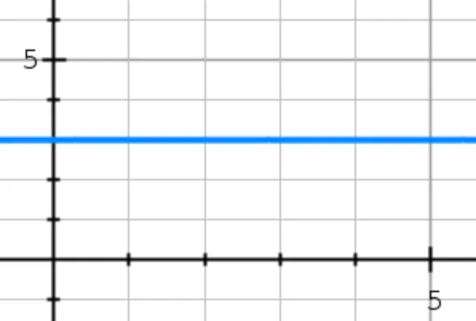
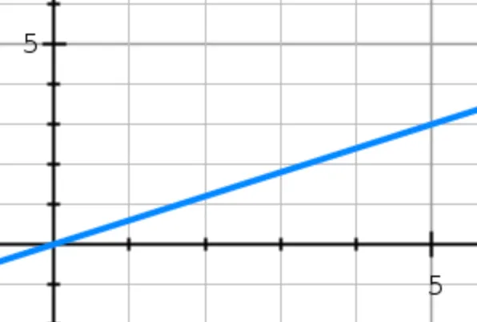
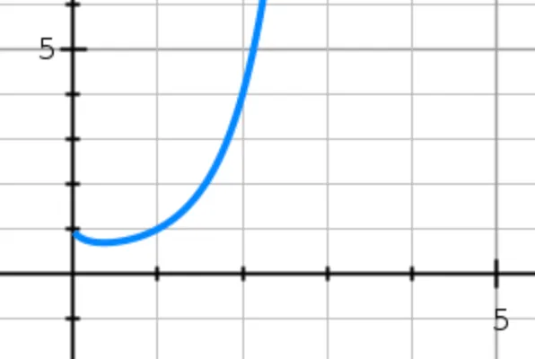

# 시간복잡도와 BigO 표기법

## Constant Time

- 주어진 input으로 기능을 수행할 때 항상 동일한 수의 단계를 밟거나 같은 시간이 걸리는 함수를 표현
- BigO 표기법으로는 O(1)이라고 한다
- BigO 표기법은 수치화가 아닌 알고리즘의 구조를 가늠하기위해 사용한다
    - 예를들어 어떤 함수가 input에 관련없이 항상 2단계의 과정을 통해 결과를 도출한다고 하자. 이를 BigO 표기법으로 O(2)가 아닌 O(1)로 표현한다. BigO는 함수의 수(quantity)가 아닌 함수의 행위를 표기하기 때문이다.

## Linear Time

- 더 큰 인풋일 때 더 많은 시간이 걸리는 함수를 말할 때 사용
- O(n)
    - n은 함수가 결과를 반환하기 위해 밟아야하는 단계의 수나 받아야하는 인풋을 의미하지만 직접적으로 숫자를 넣지않고 단순히 n으로만 표시한다
- 예시
```
let maxLimit = 100;

function oddSum(max) {
    let sum = 0;
        for(let i=1; i<=max; i++){
            if(i%2 != 0){
                sum += i;
            }
        }
    return sum;
}

console.log(oddSum(maxLimit));
```

## Quadratic Time

- 주어진 input 대비 함수의 수행 시간이 제곱으로 증가하는 함수
- O(n<sup>2</sup>)


## 출처
- https://levelup.gitconnected.com/time-complexity-and-bigo-notation-linear-time-constant-time-and-quadratic-time-686c279ecd88