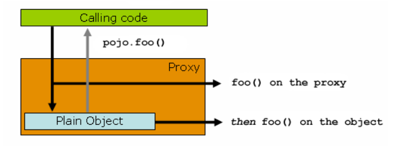

# AOP란?

## AOP 정의

AOP(=Aspect Oriented Programming)란 횡단 관심사들의 모듈화를 가능하게 하는 기능이다.이 기능은 쉽게 말하면 핵심기능을 앞 뒤로 둘러싸고 있는 반복되고 부가적인 코드를 따로 분리해서 실행 중에 자동으로 추가해주는 기능을 말한다.

### 횡단 관심사

횡단관심사(cross-cutting concerns)라는 어려운 이름도 가지고 있다. 모듈의 구분 없이 공통적으로 사용하는 기능들(logging, security, Tx..)을 각 모듈마다 구현하지 않고 따로 떼어서 실행 중에 자동으로 추가해주기 때문에 여러 관심사(모듈들)를 가로지른다는 특징에서 그 이름이 나왔다.
</br></br>

<p align="center">

</p>
</br></br>

### AOP의 적용

AOP는 핵심 기능에 부가기능을 동적으로(=실행 중에) 추가해주는 기능이다. 그렇다면 어디에 추가를 할 수 있을까? 핵심기능의 시작, 끝 또는 양쪽에 추가할 수 있다. 정확하게는 핵심기능이 구현된 메서드의 시작과 끝에 추가할 수 있다.

## AOP와 관련된 용어

- aspect : 여러개의 클래스들을 가로지르는 관심사의 모듈화.(ex. Transaction) Spring에서 aspect는 @Aspect가 선언된 클래스로 구현된다.
- target : 핵심 기능이 구현된 객체. 한 개 혹은 여러개의 aspect들이 추가될 수 있다.
- advice : aspect가 하는 행동을 말한다. 하지만 이 말이 굉장히 모호한데, 쉽게 말하자면 실행 중에 각 join point에 코드(부가기능)가 추가되는 것을 의미한다. (이 글에서는 헷갈리니까 aspect를 advice과 거의 동일한 의미로 사용하겠다.)
- proxy : advice가 동적으로 target에 추가되어 생성된 객체
- weaving : advice가 동적으로 target에 추가되어 proxy객체가 만들어지는 것
- join point : 프로그램 실행 중의 한 지점(a point)를 의미한다. Spring에서는 메서드의 실행(a method execution)을 의미한다. 쉽게 말해 advice가 추가된 메서드
- pointcut : advice가 추가될 join point의 조건.
- introduction : advice가 추가된 어떤 객체에나 새로운 인터페이스를 추가할 수 있게 해준다. 뭔지 잘 모르겠다. 실제로 사용해봐야 감이 잡히겠다.

### Advice의 종류

- before(@Before) : 메서드의 시작 부분에 코드 자동 추가
- After(@After) : 메서드의 끝 부분에 코드 자동 추가
- around(@Around) : 메서드의 시작과 끝 부분에 코드 자동 추가
- after returning(@AfterReturning) : 메서드가 정상적으로 완료되었을 때 코드 자동 추가(return문 전에 추가됨)
- after throwing(@AfterThrowing) : 예외가 발생했을 때 예외를 던진 이후에 코드 자동 추가

-> around advice는 가장 일반적인 종류의 adivce이지만 가장 구체적으로, 필요한 부분에서만 advice를 추가하는 것이 오류 가능성을 낮추는 방법임

## AOP를 AspectJ로 간단하게 구현해보기

핵심 기능이 구현된 MyTarget 클래스와 그 안에 정의된 pointA, pointB, pointC 메서드가 있다. @Component를 사용해서 target 클래스를 빈으로 등록해주자.

```
@Component
class MyTarget {
    public void pointA(){
        System.out.println("pointA is called");
    }

    public void pointB(){
        System.out.println("pointB is called");
    }

    public void pointC(){
        System.out.println("pointC is called");
    }
}
```

위의 메서드들에 부가기능으로 추가할 MyAdvice도 정의하자.

```
@Component
@Aspect
class MyAdvice {
    @Around("execution(void aop.MyTarget.*(..))") //pointcut
    public void weave(ProceedingJoinPoint pjp) throws Throwable {
        System.out.println("[start]");
        pjp.proceed();
        System.out.println("[end]");
    }
}
```

- MyAdvice 클래스도 컨테이너에 빈으로 등록되어야 하고, @Aspect를 선언해야한다.
  @Aspect는 해당 클래스를 aspect로 선언한다.
- ProceedingJoinPoint는 join point 메서드에대한 모든 정보를 가지고 있다.(Aound advice에서만 사용가능한 클래스이다)
- pointcut은 [pointcut 패턴을 잘 설명한 waterpunch님의 글](https://wpunch2000.tistory.com/22)을 보자.
- 리턴타입은 다른 advice에 결과값을 넘길 때는 Object, advice를 단독으로 사용할 때는 void로 선언한다.

이제 MyTarget에 선언된 pointA,B,C 메서드를 호출해보자. applicationContext를 직접 생성해서 객체들을 스캔하고 생성해서 가져왔다.

```
Class Main {
        ApplicationContext ac = new GenericXmlApplicationContext("file:web/WEB-INF/applicationContext_aop.xml");

        MyTarget target = (MyTarget) ac.getBean("myTarget");
        target.pointA();
        target.pointB();
        target.pointC();
}
```

```
//결과
[start]
pointA is called
[end]
[start]
pointB is called
[end]
[start]
pointC is called
[end]
```

MyTarget의 메서드들의 결과값 앞 뒤에 MyAdvice의 코드들이 추가된 것을 확인할 수 있다.

### Spring AOP is proxy-based

#### proxy-based

[공식 문서](https://docs.spring.io/spring-framework/docs/5.3.x/reference/html/core.html#aop-understanding-aop-proxies)에서 더 자세한 내용을 볼 수 있다. 간략하게 정리하자면, 한 클래스(pojo, vanilla, not-proxy)에서 다른 클래스의 메서드를 호출할 때는 참조변수를 통해 메서드를 직접 호출한다.

```
public class SimplePojo() implement Pojo{
    public void poo(){
        this.bar();
    }

    public void bar(){...}
}

public class Main(){
    public static void main(){
        Pojo pojo = new SimplePojo();
        pojo.poo(); //객체 참조 변수를 통해 직접 호출
    }
}
```

하지만 참조하는 객체가 proxy일 떄는 조금 다르다.


```
public class Main {

    public static void main(String[] args) {
        ProxyFactory factory = new ProxyFactory(new SimplePojo());
        factory.addInterface(Pojo.class);
        factory.addAdvice(new RetryAdvice());

        Pojo pojo = (Pojo) factory.getProxy();
        // proxy 객체에 대한 메서드 호출
        pojo.foo();
    }
}
```

Main 클래스에서 foo()를 호출할 때 SimplePojo 객체가 아닌 **proxy 객체**에 대해 메서드를 요청한다. proxy는 호출이 시작되어 Simplepojo객체까지 도달되기 전에 메서드 호출과 관련된 advice가 적용될 수 있게 넘긴다. 마침내 SimplePojo 객체에 접근해서 내부 코드가 실행될 때 this를 사용해 같은 클래스의 메서드를 '**내부 호출(self-invocation)**'한다. 이 때가 중요한데, **내부 메서드 호출 시에는 이 메서드 호출과 관련된 advice가 붙지 않는다**.

따라서 Spring AOP가 proxy-base라는 말은 **반드시 proxy 객체를 대상으로 메서드 호출을 해야 advice가 동적으로 추가된다**는 의미이다. 그렇기 때문에 위의 예시 같은 경우를 막으려면 this 키워드의 사용을 막는 등의 조치를 해주거나, 아예 proxy base가 아닌 AspectJ를 사용하면 된다.

### Spring AOP와 AspectJ

#### Spring Aop는

- 순수 자바로 구현되었고
- 완전한 AOP를 구현하는 것이 목적이 아니라, Spring IoC와의 긴밀한 통합을 제공해서 프로그래머들이 마주한 문제를 해결하기 위함이 목적이다.
- Spring AOP는 proxy-base라 self-invocation 이슈가 있다(this 참조의 메서드는 advice 적용이 안됨)

#### AspectJ는

- 자바 언어의 aspect 지향적인 extension이다.
- 완전한 AOP 솔루션을 제공한다
- Spring AOP보다 강력하지만 훨씬 복잡하다
- 모든 도메인 개체에 적용될 수있다(Spring AOP는 spring container가 관리하는 bean에만 적용 가능)
- proxy-base가 아니라 self-invocation 이슈가 없다.
- eclipse 재단에서 개발을 했더라

## 참조

- [남궁성 선생님의 스프링의 정석](https://fastcampus.co.kr/dev_academy_nks)
- https://www.baeldung.com/spring-aop-vs-aspectj
- https://docs.spring.io/spring-framework/reference/core/aop/introduction-defn.html
