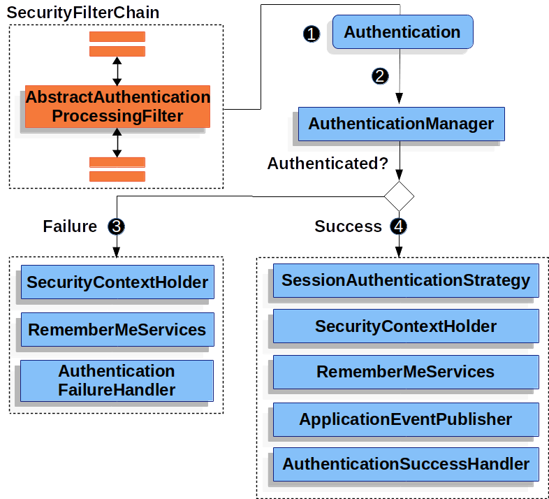

# spring security - Servlet Authentication Architecture

## 인증(Authentication)이란?

특정한 리소스에 접근하려는 사용자의 신원을 확인하는 것을 인증이라고 한다. Servlet Authentication architecture에 대해 정리 요약한 글이다.

## SecurityContextHolder

Spring Security는 인증된 사용자의 정보를 SecurityContextHolder에 저장한다. 조금 더 자세히 들여다보면 그림에서 볼 수 있듯 SecurityContextHolder - SecurityContext - Authentication 순으로 포함하고 있다. `SecurityContextHolder`는 `SecurityContext`를 유지하며 `SecurityContext`는 사용자의 개인정보가 저장되어있는 `Authentication` 객체를 포함한다.

Spring Security는 `SecurityContextHolder`가 저장하는 정보가 어떻게 저장되었는지에(수동이든, 자동으로 설정된 것이든..) 상관없이 그 정보를 신뢰하고 사용한다. `SecurityContextHolder`가 포함하고 있는 값이면 현재 인증된 사용자로 인식하는 것.

### ThreadLocal

`ThreadLocal`은 Java에서 Thread 간에 독립적인 데이터를 유지하기 위해 사용하는 클래스이다.

`SecurityContextHolder`는 인증된 사용자의 정보를 저장하기 위해서 `ThreadLocal`을 사용한다. 한 번 `ThreadLocal`에 정보를 저장하면 Thread 내에서는 반복적으로 저장한 데이터에 쉽게 접근할 수 있다. 예를 들면 `ThreadLocal`에 인정 정보를 저장하면 `SecurityContext`는 인증 정보가 필요할 때마다 매번 메서드에 정보를 넘기지 않아도 된다.

`ThreadLocal`은 인증 후 초기화가 매우 중요하다. Thread가 다음 요청을 처리할 때 이전 인증과 관련된 데이터가 남아있으면 안되기 때문이다. Spring Security에서는 `FilterChainProxy`가 `SecurityContext`를 깨끗히 비우게 한다.

모든 Application이 ThreadLocal을 사용하기에 완전히 적합하지는 않다.

## Authentication

이 객체는 위에서 설명했듯, 인증 후 사용자의 정보를 저장하는 객체이다. 사실 인터페이스이다. 앞으로 나오는 `Authentication`은 그것의 구현체로 이해하면 된다.

사용자가 인증하려고 입력한 정보(비밀번호, 아이디)가 `Authentication`에 저장된다. 이 `Authentication`을 `AuthenticationManager`에 넘겨서 인증 방식에 맞게 인증을 시도한다.
이 과정에서 `UserDetailService`가 DB에서 사용자 정보를 조회해서 `UserDetail` 객체를 생성한다. `Authentication` 정보와 `UserDetail`의 정보를 비교하여 사용자의 신원을 확인한다. 인증에 성공한 경우 `UserDetail` 정보는 `Authentication`에 저장된다.

`AuthThentication`은 다음의 세가지를 포함한다.

- principal : `UserDetail` 인스턴스. 사용자의 실제 정보(DB에서 가져온)
- credentials : 인증에 필요한 password같은 자격 증명 정보. 인증 성공 후에는 `ProvideManager`가 이 민감한 정보를 지움.
- authorities : `GrantedAuthority` 인스턴스(role, scope)

## GrantedAuthority

사용자에게 부여된 권한(들)을 나타내는 객체이다. 이 권한은 애플리케이션 전체걸쳐 사용되어서 특정 유저나 리소스에 적용되는 용도로 사용되지는 않는다(이 용도는 ACL, DomainObjectSecutiry 참조)

## AuthenticationManager

이 친구는 인증 처리 방법을 정의하는 API이다. 인증이 필요할 때 `AuthenticationManager`가 필요한 Filter를 호출하고 인증 후 반환된 `Authentication`을 `SecurityContextHolder`에 저장한다. 직접 인증을 할 때는 `AuthenticationManager`가 필요없다.

가장 흔히 사용되는 구현체가 `ProvideManager`이다.

## ProvideManager

인증 처리 방법을 정의하는 작업을 AuthenticationProvider에게 위임한다. 사실 이것 자체는 하는 일은 없다. 그렇다면 왜 필요할까?

위임 대상인 `AuthenticationProvider`들은 각각 다른 인증 처리 방법을 알고 있다. 인증 요청이 왔을 때 `ProviderManager`가 각각의 `AuthenticationProvider`들이 처리할 수 있는 인증 대상인지 차례로 확인한 후 인증 실패, 성공을 결정한다. 만약 어떤 provider도 인증을 처리할 수 없다면 `ProviderNotFoundException`이 발생한다.

인증의 종류와 관계 없이 처리하는 객체를 하나만 호출해도 하위 여러개의 `AuthenticationProvider`들 중 하나가 인증 방식에 맞게 처리한다.

`ProvideManager`은 `Authentication`의 credential을 인증 후에 지운다. 민감한 정보이기 때문이다. `Authentication`내의 `UserDetail` 정보를 cache하는 경우가 있다. cache하는 이유는 권한확인 같은 반복적으로 인증 정보가 필요할 때 DB 조회를 줄이고 빠르게 사용자 정보를 조회할 수 있기 때문이다. 하지만 `ProvideManager`가 인증 후 `Authentication`의 credential 정보를 지운다면 인증이 불가하기 때문에 cache가 무용해진다. 하지만 JWT로 인증하는 경우는 전혀 문제가되지 않는다. 사용자의 인증 정보가 모두 JWT 토큰에 담겨있기 때문에 서버에 cache로 저장하지 않아도 된다.

## AuthenticationProvider

각각의 `AuthenticationProvider`들은 각각 다른 종류의 인증을 수행한다. 예를 들어 `DaoAuthenticationProvider`는 username/password로 `JWTAuthenticationProvider`는 JWT token으로 인증한다.

## Request Credentials with AuthenticationEntryPoint

`AuthtenticationEntiryPoint`는 인증이 필요한 사용자에게 HTTP 응답을 보낼 떄 사용된다. 예를 들어 '/user/history' 요청은 로그인 권한이 필요하다. 로그인하지 않은 사용자에게 '/login' 으로 리다이렉트 할 수 있게 HTTP 응답을 보내는 역할을 한다.

## AbstractAuthenticationProcessingFilter

사용자의 신원 정보(아이디/패스워드 등)을 인증하기 위해 사용하는 base Filter이다.

1. 사용자가 인증을 한다. `AbstractAuthenticationProcessingFilter`는 `HttpServletRequest`으로부터 사용자가 입력한 정보를 포함하는 `Authentication`을 생성한다.

   `Authentication`의 구현체는 `AbstractAuthenticationProcessingFilter`을 상속받은 클래스의 종류에 따라 다르다. 하위 클래스가 `UsernamePasswordAuthenticationFilter`일 경우 `UsernamePasswordAuthenticationToken`을 생성한다.(username/password)

2. `Authentication`이 `AuthenticationManager`에 전달되어 인증이 수행된다.
3. 인증이 실패할 경우

   - `Authentication`을 저장하고 있는 `SecurityContextHolder`가 깨끗이 비워지고
   - `RememberMeService.loginFile`이 호출된다
   - `AuthenticationFailuerHandler`가 호출된다. 실패 이후의 로직을 작성할 수 있다.

4. 인증이 성공한 경우

   - `Authentication`이 `SecurityContextHolder`에 저장된다.
   - `AuthenticationSuccessHandler`가 호출된다. 성공 이후의 로직을 작성할 수 있다.

## 참조(+사진)

https://docs.spring.io/spring-security/reference/servlet/authentication/architecture.html#servlet-authentication-authenticationmanager
