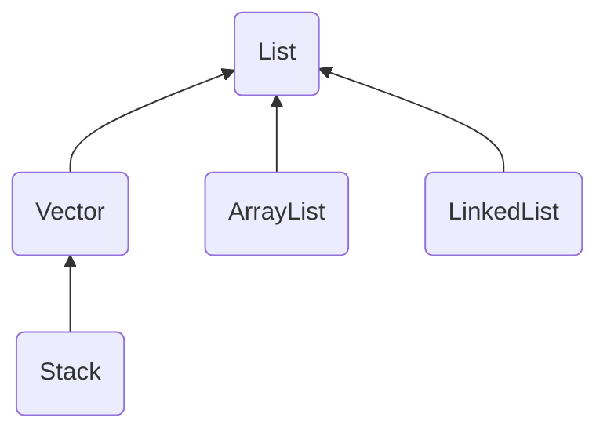

# Java의 List


## List
### List의 특징
- Collection 을 상속하는 인터페이스
- 중복을 허용
- 순서 유지가 보장됨
- List의 상속 계층 구조


## ArrayList
### ArrayList의 특징
- Vector의 기능을 개선한 클래스 (되도록이면 Vector 대신 ArrayList를 사용하자)
- 내부적으로 **Object 배열**을 이용하여 데이터를 저장한다
    - 배열 길이를 초과하면 더 긴 길이의 배열을 생성하고 복사함
        - 그래서 **배열 길이를 처음에 여유롭게 설정**해주는 것이 좋다
        - 비효율적인 메모리 사용이라는 단점이 있다(사용하지 않을지도 모르는 저장공간을 성능을 위해 할당해야하니까)
        - 배열 길이 초과 시, 어떻게 얼만큼 새로운 배열을 생성하는지는 어느 정도의 시간 비용이 발생한다는 것 이상으로는 명시되어있지 않다.(JDK 11기준)(어느 영상애서 doubling을 설명하기에 헷갈려서..)
            > Each ArrayList instance has a capacity. The capacity is the size of the array used to store the elements in the list. It is always at least as large as the list size. As elements are added to an ArrayList, its capacity grows automatically. The details of the growth policy are not specified beyond the fact that adding an element has constant amortized time cost.
    - 배열의 중간 요소를 삭제하거나 추가하면 다른 데이터 구조보다 더 오래걸림(뒤의 요소들이 자리이동을 해야하니까)

### 구현
```
import java.util.*;

public class MyVector implements List {
    Object[] data; 
    int capacity = 0; //용량
    int size = 0; //크기

    public MyVector(int initialCapacity) {
        if (initialCapacity < 0) {
            throw new IllegalArgumentException("유효하지 않은 값입니다. :" + capacity);
        }

        this.capacity = initialCapacity;
        data = new Object[capacity];
    }

    public MyVector() {
        this(10);
    }

    public void ensureCapacity(int minCapacity) {
        if (minCapacity - data.length > 0) {
            setCapacity(minCapacity);
        }
    }

    private void setCapacity(int capacity) {
        if (this.capacity == capacity) {
            return;
        }

        Object[] tmp = new Object[capacity];
        System.out.println("배열 복사");
        System.arraycopy(data, 0, tmp, 0, size);
        data = tmp;
        this.capacity = capacity;
    }

    @Override
    public int size() {
        return size;
    }

    @Override
    public boolean isEmpty() {
        return size==0;
    }

    @Override
    public boolean contains(Object o) {
        for (Object obj : data) {
            if (obj == o) {
                return true;
            }
        }
        return false;
    }

    @Override
    public Object[] toArray() {
        Object[] objArr = new Object[size];
        System.out.println("배열 복사");

        System.arraycopy(data, 0, objArr, 0, size);

        return objArr;
    }

    @Override
    public Object[] toArray(Object[] a) {
        if (a.length < size) {

            return Arrays.copyOf(data, size, Object[].class);
        }
        System.out.println("배열 복사");

        System.arraycopy(data, 0, a, 0, size);
        if (a.length > size) {
            a[size] = null;
        }

        return a;
    }

    @Override
    public boolean add(Object o) {
        ensureCapacity(size + 1);
        data[size++] = o;

        System.out.printf("+ size: %d, datasize: %d%n", size, data.length);

        return true;
    }

    @Override
    public void add(int index, Object element) {
        if (index < 0 || index > size-1) {
            throw new IndexOutOfBoundsException();
        }

        ensureCapacity(size+1);

        System.out.println("배열 복사");

        System.arraycopy(data, index, data, index+1, size-index);
//        for (int i = size-1; i >= index; i--) {
//            data[i + 1] = data[i];
//        }

        data[index] = element;
        size++;

        System.out.printf("+ size: %d, datasize: %d%n", size, data.length);
    }

    @Override
    public boolean remove(Object o) {
        int dataLength = data.length;

        for (int i=0; i<dataLength; i++) {
            if (data[i] == o) {
                System.arraycopy(data, i+1, data, i, dataLength-i-1);
                data[dataLength-1] = null;
                size--;
                System.out.printf("- size: %d, datasize: %d%n", size, data.length);

                return true;
            }
        }
        System.out.printf("- size: %d, datasize: %d%n", size, data.length);

        return false;
    }

    public void trimToSize() {
        setCapacity(size);
    }

    @Override
    public boolean addAll(Collection c) {
        return false;
    }

    @Override
    public boolean addAll(int index, Collection c) {
        return false;
    }

    @Override
    public void clear() {
        for (int i = 0; i < size; i++) {
            data[i] = null;
        }

        size = 0;
    }

    @Override
    public Object get(int index) {
        if (index < 0 || index > size-1) {
            throw new IndexOutOfBoundsException();
        }

        return data[index];
    }

    @Override
    public Object set(int index, Object element) {
        if (index < 0 || index > size-1) {
            throw new IndexOutOfBoundsException();
        }

        Object oldObj = data[index];
        data[index] = element;

        return oldObj;
    }

    @Override
    public Object remove(int index) {
        if (index < 0 || index > size-1) {
            throw new IndexOutOfBoundsException();
        }

        Object oldObj = data[index];

        if(index != size-1) {
            System.out.println("배열 복사");

            System.arraycopy(data, index + 1, data, index, size - index - 1);
        }

        data[size - 1] = null;
        size--;

        return oldObj;
    }

    public int getCapacity() {
        return capacity;
    }

    @Override
    public int indexOf(Object o) {
        for (int i = 0; i < size; i++) {
            if (data[i].equals(o)) {
                return i;
            }
        }
        return -1;
    }

    @Override
    public int lastIndexOf(Object o) {
        for (int i = size-1; i >= 0; i--) {
            if (data[i].equals(o)) {
                return i;
            }
        }
        return -1;
    }

    @Override
    public Iterator iterator() {
        return null;
    }

    @Override
    public ListIterator listIterator() {
        return null;
    }

    @Override
    public ListIterator listIterator(int index) {
        return null;
    }

    @Override
    public List subList(int fromIndex, int toIndex) {
        return null;
    }

    @Override
    public boolean retainAll(Collection c) {
        return false;
    }

    @Override
    public boolean removeAll(Collection c) {
        return false;
    }

    @Override
    public boolean containsAll(Collection c) {
        return false;
    }
}
```

## LinkedList 
### 배열의 단점
- 배열은
    1. 크기를 변경할 수 없다
        - 변경해야 할 때는 더 큰 배열을 생성한 다음 기존의 배열을 복사해야 한다
    2. 중간 요소의 추가 및 삭제가 다른 데이터 구조보다 더 오래 걸린다(요소의 재배치에 시간이 걸림)
### LinkedList의 특징
- Array의 단점을 극복하기 위해 LinkedList 자료구조가 고안됨
- 불연속적인 데이터를 연결한 데이터 구조
- 각 요소(node)는 저장하는 데이터와 다음 요소에 대한 참조를 저장한다
- 추가 및 삭제 시에 추가하는 요소와 전, 후 요소의 참조 데이터만 수정하면 되므로 처리 속도가 빠르다
- 이전 요소에 대한 접근이 어렵다

### DoubleLinkedList
- LinkedList의 이전 요소 접근이 어렵다는 단점을 보완한 데이터 구조
- 단순히 Node에 이전 요소에 대한 참조를 더한 것

```
class Node{
	Node next;
	Node previous;
	Object ojb;
}
```

## DoubleCircularLinkedList
- DoubleLinkedList에 대한 접근성을 보다 향상시킨 데이터 구조
- List의 처음과 끝 node를 서로 연결시킴
- 실제로 LinkedList는 이름과는 달리 이 DoubleCircularLinkedList 구조로 구현되어있음

## ArrayList vs LinkedList
- 순차적인 삭제와 추가 시에는 ArrayList가 더 빠르다
    - 단, 저장 공간이 부족할 시에는 LinkedList가 더 빠를 수 있다
- 중간 데이터 추가, 삭제 시 LinkedList가 더 빠르다
    - ArrayList는 데이터 재배치에 시간이 걸리기 때문이다
- 데이터 검색 시 ArrayList가 더 빠르다
    - Array는 RandomAccess라는 특징 때문에 index만 알면 O(1)이다
    - LinkedList는 검색할 때 차례로 데이터에 접근하기 때문에 저장하는 데이터가 많을 수록 검색시간이 더 길어진다

||차이점|
|---|---|
|ArrayList|다루고자 하는 데이터의 갯수가 변하지 않을 때 사용|
|LinkedList|다루는 데이터의 갯수에 변경이 잦을 경우 사용|

